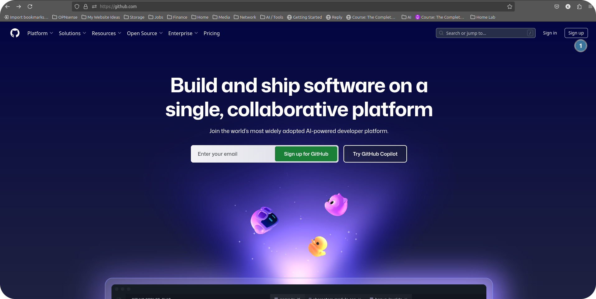
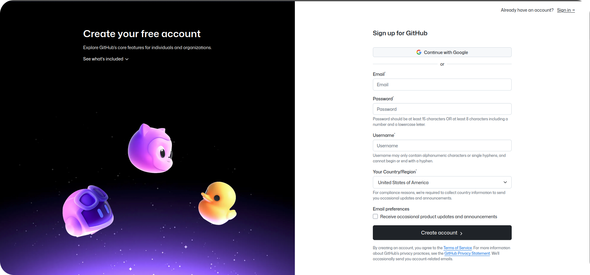
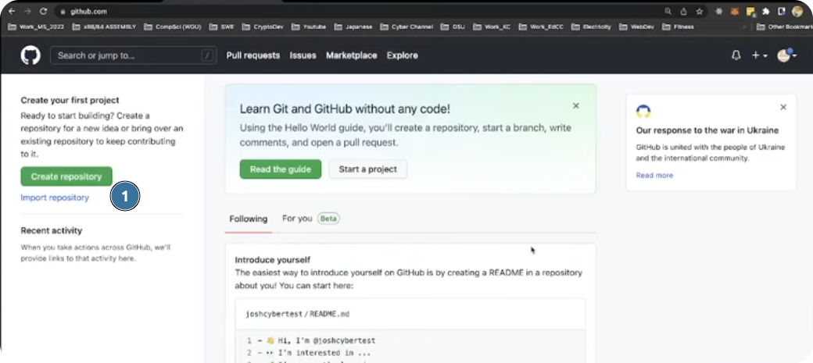
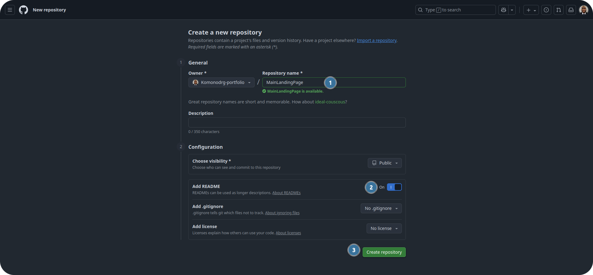
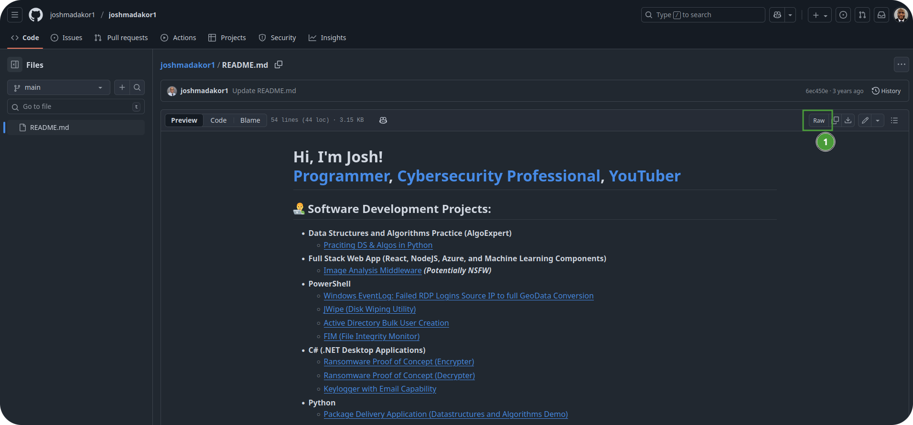
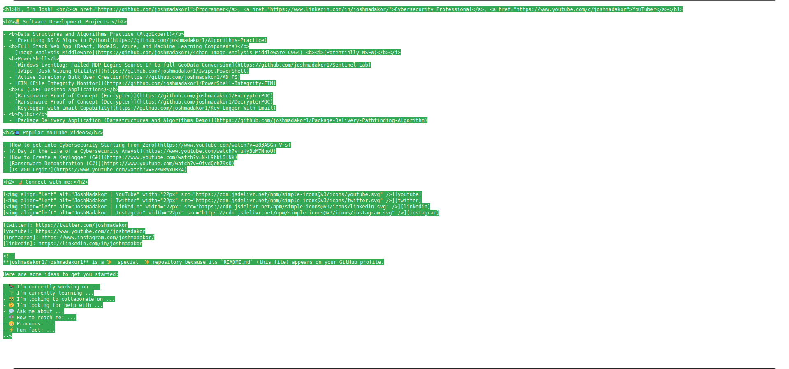
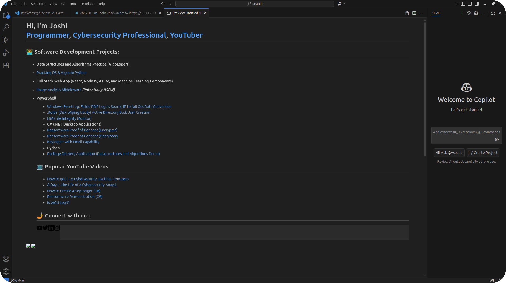
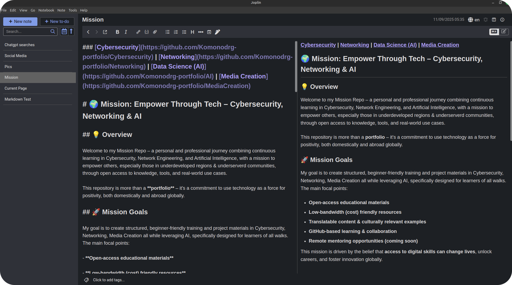

### [Home](https://github.com/Komonodrg-portfolio)  | [Cybersecurity](https://github.com/Komonodrg-portfolio/Cybersecurity) | [Networking](https://github.com/Komonodrg-portfolio/Networking) | [Data Science (AI)](https://github.com/Komonodrg-portfolio/AI) | [Media Creation](https://github.com/Komonodrg-portfolio/MediaCreation) | [Mission](https://github.com/Komonodrg-portfolio/Mission/)

---
---

# 🌐 Building a GitHub Portfolio Website

## 📌 Project Overview
This project documents how I built my **personal portfolio website** using **[GitHub](https://chatgpt.com/s/t_68dc3dacec4881919e375db2e89b9fc6)** as the hosting and version control platform.  

The goal is to not only create an engaging and professional site, but also to **showcase best practices** in using GitHub for portfolio building — from repository organization and README design to leveraging GitHub Pages for deployment.  

This repository serves as both a **live portfolio site** and a **guide for others** who want to create their own.  

---
## 🧰 Tools & Technologies

| Tool       | Purpose                              |
|------------|--------------------------------------|
| GitHub / Github Pages     | Free static site hosting         |
| Markdown / HTML  | Content structure and styling         |
| GIMP   | Image Editing          |
| Flameshot   | Screen / Image Capturing & Editing          |
| Git  | Version control and collaboration                      |
| Joplin / VS Code   | Note taking / Version control and collaboration          |
|Onenote  | Microsoft offering for Note Taking   | 


<details>
 <summary><h3><em><b>🪂  "One Man's Thoughts..."</b></em></h3></summary>
  <br> 
<em>The need for a central hub to market your skills is a <b>MUST</b>.  Github is a platform universally known and figured I'd use it, at the very least, because it would efficiently provide my content in a visually pleasing and platform agreeable (PC, Mobile Device) way.<br>
<br>
<br>
Colleages, Onward.</em>
<br>
</details>
 
---

## Setup Instructions

1) Navigate to github.com and `signup` to create and account:<br>

 <br>

2) Create 1st Repository, making sure to toggle on `Add Readme`:

 <br>

3) Now with first repo created, it's time to edit the readme file.  This will be the landing page for your main github page.  I followed a great tutorial on [youtube](https://www.youtube.com/watch?v=zgqfWLHNKLk) on how to efficiently create/edit this readme.  Following this example, `copy & paste` the markdown code from his tutorial and paste it into your readme & `Commit changes...`:<br>
     
<h4><b>Markdown:</b></h4>
   
      
    <h1>Hi, I'm Josh! <br/><a href="https://github.com/joshmadakor1">Programmer</a>, <a href="https://www.linkedin.com/in/joshmadakor/">Cybersecurity Professional</a>, <a href="https://www.youtube.com/c/joshmadakor">YouTuber</a></h1>

    <h2>👨‍💻 Software Development Projects:</h2>

    - <b>Data Structures and Algorithms Practice (AlgoExpert)</b>
    - [Praciting DS & Algos in Python](https://github.com/joshmadakor1/Algorithms-Practice)
    - <b>Full Stack Web App (React, NodeJS, Azure, and Machine Learning Components)</b>
    - [Image Analysis Middleware](https://github.com/joshmadakor1/4chan-Image-Analysis-Middleware-C964) <b><i>(Potentially NSFW)</b></i>
    - <b>PowerShell</b>
    - [Windows EventLog: Failed RDP Logins Source IP to full GeoData Conversion](https://github.com/joshmadakor1/Sentinel-Lab)
    - [JWipe (Disk Wiping Utility)](https://github.com/joshmadakor1/Jwipe.PowerShell)
    [Active Directory Bulk User Creation](https://github.com/joshmadakor1/AD_PS)
    - [FIM (File Integrity Monitor)](https://github.com/joshmadakor1/PowerShell-Integrity-FIM)
    - <b>C# (.NET Desktop Applications)</b>
    - [Ransomware Proof of Concept (Encrypter)](https://github.com/joshmadakor1/EncrypterPOC)
    - [Ransomware Proof of Concept (Decrypter)](https://github.com/joshmadakor1/DecrypterPOC)
    - [Keylogger with Email Capability](https://github.com/joshmadakor1/Key-Logger-With-Email)
    - <b>Python</b>
    - [Package Delivery Application (Datastructures and Algorithms Demo)](https://github.com/joshmadakor1/Package-Delivery-Pathfinding-Algorithm)

    <h2>📺 Popular YouTube Videos</h2>

    - [How to get into Cybersecurity Starting From Zero](https://www.youtube.com/watch?v=a83ASGn_V_s)
    - [A Day in the Life of a Cybersecurity Anayst](https://www.youtube.com/watch?v=uHy3oM7NnoU)
    - [How to Create a KeyLogger (C#)](https://www.youtube.com/watch?v=N-L9hklSlNk)
    - [Ransomware Demonstration (C#)](https://www.youtube.com/watch?v=OfvdQeh79s0)
    - [Is WGU Legit?](https://www.youtube.com/watch?v=E2MwRWxDBkA)

    <h2> 🤳 Connect with me:</h2>

    [][youtube]
    [][twitter]
    [][linkedin]
    [][instagram]

    [twitter]: https://twitter.com/joshmadakor
    [youtube]: https://www.youtube.com/c/joshmadakor
    [instagram]: https://www.instagram.com/joshmadakor/
    [linkedin]: https://linkedin.com/in/joshmadakor
    ```

    <!--
    **joshmadakor1/joshmadakor1** is a ✨ _special_ ✨ repository because its `README.md` (this file) appears on your GitHub profile.

    Here are some ideas to get you started:

    - 🔭 I’m currently working on ...
    - 🌱 I’m currently learning ...
    - 👯 I’m looking to collaborate on ...
    - 🤔 I’m looking for help with ...
    - 💬 Ask me about ...
    - 📫 How to reach me: ...
    - 😄 Pronouns: ...
    - ⚡ Fun fact: ...
    -->

  <br>

4. Now with a solid base, it's time to edit the file.  You can edit the readme by toggling between `edit` & `preview` buttons on page.  I recommend using either one of these two applications for markdown/html rendering:
   - Joplin  (my personal favorite for this, as well as replacing OneNote as linux option for note taking)
   - VS Code
  
   Installation instructions for both can be found [here](https://chatgpt.com/s/t_68dc7e0aff088191ad988a777cd6b397).  Sticking to the command line (Termimal) steps works best.

     <br>

5.  Getting comfortable to [Markdown and HTML syntax](https://chatgpt.com/s/t_68dc8873f4c4819197ded29dcc79108c) is key for properly formating your readme files.  Practice makes perfect.

6.  Adding images to your readme will further allow you to create a more engaging portfolio.  2  applications I use to assist in implementing pictures in my projects are:
   - [Flameshot](https://chatgpt.com/s/t_68dc8a3f95a08191910a402d0d600b85)
   - [GIMP](https://chatgpt.com/s/t_68dc8bba0354819199fd1ed46565a81e)

   After editing the screenshot taken and saving the .png image file, I typically create an `images/` folder on the repo page and upload my created images to it.  I proceed to reference the image(s) using markdown syntax to have it display in on my Readme:

   

   

## 📂 Repository Structure
```plaintext
.
├── docs/                   # Assets and diagrams
├── screenshots/            # Example site previews
├── src/                    # Source HTML/CSS/JS (if not pure Markdown)
├── .github/                # GitHub workflow automation (optional)
├── index.md / index.html   # Landing page
└── README.md               # Project documentation (this file)
